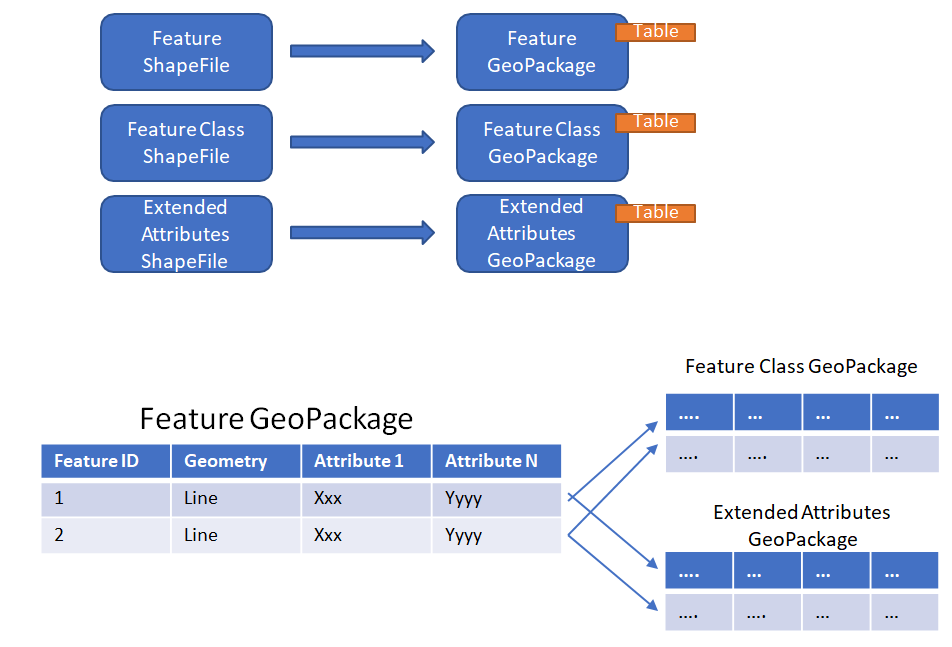
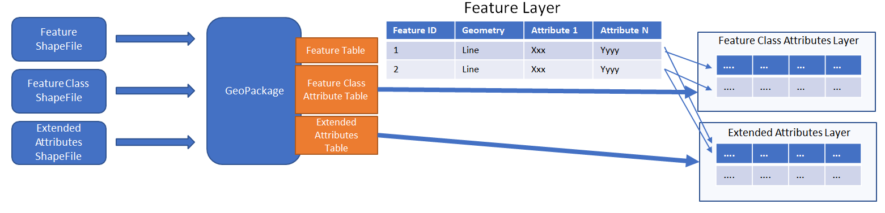
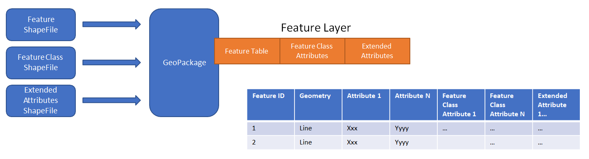
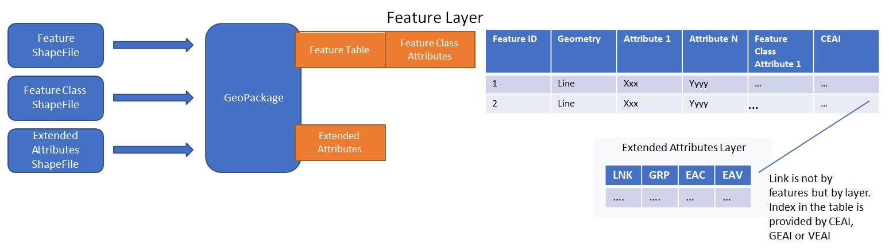

[[DetailedClause]]
== Details of the Experiments Performed
This section discusses the experiment and particpant participation in detail. The experiments performed in this Interoperability Experiment include:

- Experiment 1: Conversion of Shapefiles in one or more CDB data stores into Geopackages as required for Experiments 2, 3, and/or 4.
- Experiment 2: One to one conversion of a Shapefile into a GeoPackage. There are four sub-options that are described below.
- Experiment 3: Store each CDB LOD as a layer in GeoPackage.
- Experiment 4: Store each Geocell of Vector Data as a layer in GeoPackage.

The following tables for provides an overview of wchich experiments were executed by each particpant.

|===
|Participant|Experiment 1|Experiment 2|Experiment 3|Experiment 4
|Aechelon|X|X| |
|CAE|X|X| |
|Compusult|X|X|X|X
|FlightSafety|X|X|X|X
|Hexagon/Luciad|X|X|X|X
|VATC|X|X| |
|===

- Aechelon - Options 1a, 1b & 1c with the Yemen and Los Angeles DBs
- Presagis - If time permit, we will also test the dynamic creation of Vector data when the simulation modifies the database at runtime.
- VATC - Supported Option 1b initially both with data creation and opensource visualization of this option. We will make a best effort to include visualization for Compusult’s LA updates as well as our own (and others as published) .  It is our intent as well to support one other option (option 3 most likely)

=== A CDB Data Store - General Overview

A CDB structured data store is physically arranged on disk into the following top level directory structures:

- Metadata contains a set of XML metadata and controlled vocabulary files that are global to the data store.
- GTModel contains geotypical models, generic models that are defined once in the CDB and are intended to be rendered in multiple places throughout the data store (contrast with geospecific or GS models). They aren’t intended to represent specific objects, but simply a typical representation of an object type such as a tree.
- MModel contains Moving Models, which don’t have a fixed location and are intended to be dynamically placed and moved throughout a simulation. An example is an automobile or aircraft.
- Tiles contains tiled datasets. This is the structure in which the majority of vector based Shapefiles are stored.
- Navigation contains global navigation datasets.

A CDB data stored is structured into partitions that organizes the world into 1-degree by 1-degree cells. Within each cell, the tiled datasets are organized into a Level of Detail (LOD) hierarchy. More specifically, the CDB storage model relies on three important means to organize the data: a) Tiles which organize the data into zones defined by its location with respect to a WGS84 reference system; b) Layers (or datasets) which organize different types of data in a tile; and c) Levels of Detail (LoD) which organize the data in each layer of each tile by its detail. 

Most CDB datasets are organized in a tile structure and stored in the \CDB\Tiles\ directory. The tile structure facilitates access to the information in real-time by any runtime client devices. However, for some datasets that require minimal storage, such as, Moving Models or Geotypical Models, there is no significant advantage to be added for such a tile structure. Such datasets are referred to as global datasets and consist of data elements that are global to the earth.

Point, line, and area features are encoded in a CDB store as Shapefiles and are organized into several Vector Datasets and LoDs. For each LoD, the CDB standard specifies the maximum number of points allowed per Tile-LoD and the resulting average Feature Density is defined. All vector data in a CDB store are referenced to the WGS 84 Earth-centered,  Earth-fixed  terrestrial  reference  system  and geodetic datum.

=== CDB Data and Tools Used By Participants

==== Overview

Three complete CDB data stores were provided for use in this Interoperability Experiment. The provision of CDB dta stores and the subsequent conversion of Shapefiles into GeoPackages was defined in the IE Activity Plan in Experiment 1. The participants identified a number of activities associated with executing Experiment 1. A key objective of this experiment was to capture and compare metrics as well as to identify and document any differences in the Shapefile to GeoPackage conversions that resulted from the use of different conversion tools.

==== Experiment 1: Conversion - The CDB Data Stores and tools used in this IE

This section provides a short summary of the CDB data stores and tools used by each of the participants in this OGC Interoperability Experiment. Greater detail for each particpants work can be found in Section 6 (Results) of this report.

===== Aechelon

Aechelon used the following CDB data stores in their experiments:

- Yemen (4 geocells), from Presagis.
- Downtown Los Angeles (1 geocell), from VATC.
- Greater Los Angeles (4 geocells), from Cognitics.

Aechelon used the following tools in their experiments. The CDB data stores were used as the source for content to feed a publishing process into the Aechelon Image Generator (IG) runtime format. The publishing software is in python, with invocations of C++ EXEs for performance-critical processing. The feature scan step is entirely in Python, version 3.5. The changes implemented on the publisher side to support GeoPackage were the minimal necessary to get functional parity with the Shapefile based implementation. In other words, no attempt was made to optimize the code to take advantage of the internals of the GeoPackage files using sqlite, and all data access went through the OGR module.

===== CAE Montreal
CAE did not use the sample CDB provided by the participants because their goal was to compare the performance of their internal applications when running with a CDB produced by CAE before and after the replacement of Shapefiles with GeoPackage files. However, they believe that our findings may apply equally well to other databases.

CAE used a slightly modified version of GDAL for converting Shapefiles to GeoPackages. See Section 6 Results for more detailed information.

===== Hexagon/Luciad
Hexagon/Luciad utilized the Yemen CDB data store. The tools used for all experiments are elements of Luciad CDB Studio.

The CDB Studio is a component based modular application developed using the Luciad Platform, a development platform for solving C4ISR needs in the Defense, Aviation and Maritime domains.  The Luciad CDB Studio provides the ability to create OGC CDB data stores directly from imagery, elevation, and vector geospatial data products.  The application also has strong support for GeoPackages. It can export any source, including CDB into GeoPackage imagery, elevation, or vector data. It also supports a GeoPackage styling extension and the ability to convert CDB 3D Models into OGC 3D Tiles stored in GeoPackage.

===== Presagis
Presagis provided a CDB data store for the country of Yemen. 

===== VATC
VATC provided a CDB data store created from fully open data sources footnote:[For the IE, VATC made the data available at https://storage.cloud.google.com/epic_builder/OGC_IE/LosAngeles_CDB.zip?_ga=2.3746352.-1225582785.1543877247].
The data provided in the VATC CDB data store are in one CDB Geocell containing downtown Los Angeles.The data include:

- USGS NAIP 1m background (Entire Geocell) (CDB Lod 7)
- USGS HighRes Ortho Program 1ft Ortho (Southern section of Geocell) (CDB Lod 9)
- USGS 1/3 NED Elevation (CDB Lod 4 for an entire geocell)
- OpenStreetMap Vector Map (Entire geocell)
- Los Angeles County Building footprint information. (Approximately 1,734,043 buildings were extruded from the footprint data)

VATC used opensource lib’s that were modified to support CDB (this includes OpenSceneGraph, osgEarth, and GDAL). They did not apply any changes to the GDAL library for this IE and the built GDAL version from the 3rd Party is expected to suffice for this experiment. 

==== Key discussion topics related to CDB data stores

Given the size of the CDB data stores used in this IE, there was discussion related to how best to provide data stores updated with GeoPackage content. The general concensus was that downloading the entire data store just to get the GeoPackages was non-optimal and time wasteful. Therefore, the particpants discussed using *_Version_* metadata (Volume 1 CDB Standard, Clause 5.1.8). They determined that the original CDB data with Shapefiles would be Version 1 and that CDB enhanced with GeoPackages would be Version 2. 

=== Details Related to Experiment 2

Experiment 2 focused on approaches to replacing each Shapefile in an existing CDB data store thereby consolidating the three geometry files into a single GeoPackage. The objectives was to determine the best practices for not only replacing Shapefiles for also allowing the storage and use of both Shapefiles and Geopackages in a CDB data store. Part of this experiment was to also evaluate and compare performance using the baseline CDB datasets made available as part of Experiment 1. finally, this experiment also focused on evaluating and analyzing and results from Experiment #2 related to performance, backwards-compatibility and risks to interoperability.

The Participants identifed four possible approaches to converting and/or using GeoPackages in a CDB data store.

==== Option 1a – 1:1 Conversion of Shapefiles to GeoPackages

This experiment researched the direct 1 to 1 conversion of Shapefiles in a CDB datastore into a corresponding set of Geopackages. GDAL (https://www.gdal.org/drv_geopackage.html) and << >> were used to do the conversion. Charcateristics of the Option 1a approach are:

- There is a 4:1 reduction in the  number of files.
- There is one layer (table) per  GeoPackage.
- The Feature Class and Extended Attribute files have no geometry.
- “Off the Shelf” GeoPackage  Viewers will have no compatibility  over the feature class and  extended attributes layers.
- This approach under-utilizes the  capabilities of GeoPackage.

[#img_exp2opt1a,reftext='{figure-caption} {counter:figure-num}']
.One to one conversion of Shapefiles to GeoPackages

==== Option 1b – Conversion of Shapefiles to GeoPackages using Normalized SQL Data

This experiment researched the approach of using normalized SQL in the conversion of Shapefiles into GeoPackages. This approach has the following characteristics:

- Utilizes a standard normalized relational database design, utilizing foreign keys.
- There is a 12:1 reduction in the number of files.
- There are three layers per GeoPackage.
- The Feature Class and Extended Attribute tables have no geometry.
- However, “Off the Shelf” GeoPackage software will not be aware of the extended and feature class attributes. This can be somewhat mitigated when a SQL View is used, which gives viewers (clients) read-only visibility  over these attributes.

[#img_exp2opt1b,reftext='{figure-caption} {counter:figure-num}']
.Use of Normalized SQL

==== Option 1c – Flattened Attribution

This experiment researched the approach of using flattened attribution in the conversion of Shapefiles into GeoPackages. This approach has the following characteristics:

- There is a 12:1 reduction in the number of files.
- Some duplication of data, resulting in larger files.
- There is one layer per GeoPackage.
- The Feature Class and Extended Attributes are populated for each feature.
- This approach utilizes a standard normalized relational database design, utilizing foreign keys.
- Full “Off the Shelf” GeoPackage software compatibility.

[#img_exp2opt1c,reftext='{figure-caption} {counter:figure-num}']
.Flattened Attributes Approach

==== Option 1d – Flattened Attribution + extensions

This experiment researched the approach of using flattened attribution plus the GeoPackage related Tables extension in the conversion of Shapefiles into GeoPackages. The reason for using the extension was to enhance the ease of moving data in both directions (Shapefile to GeoPackage and visa-versa) using existing tools and without any data loss. This approach has the following characteristics:

- Flatten CDB standard instance and class attribute – maximum GIS tools compatibility
- “Off the Shelf” GeoPackage software compatibility for CDB standard attributes. 
- Table (related tables) for extended attributes
- This approach utilizes a standard normalized relational database design, utilizing foreign keys.
- Some duplication of data, resulting in larger files (Class attributes).
- There is one layer per GeoPackage.
- The Feature Class and Extended Attributes are populated for each feature.

[#img_exp2opt1d,reftext='{figure-caption} {counter:figure-num}']
.Flattened Attributes Approach

=== Experiment 3 - Each CDB LoD as a layer in GeoPackage

The methodology for Experiment 3 involves: 

The goal of this experiment is to significantly reduce the number of files in both a CDB datastore and in the resulting GeoPackage. Steps in this experiment include:

- Modify implementation software to support storing an entire CDB Level of Detail (LoD) in a single GeoPackage.
- Evaluate and compare performance using the baseline CDB datasets and the Alternative #2 datasets.
- Evaluate analysis and results from Experiment #3 for performance, backwards-compatibility and risks to interoperability.

In this approach, the tables in the GeoPackage correspond to each LOD of CDB. The GeoPackage would contain 24 tables for each of the CDB LODs. Each CDB geotile would contain a GeoPackage to correspond to the CDB data stores (such road networks,
geospecific points, etc.). CDB tiles for a data store combine into a single GeoPackage table within that given LOD where the tile definition (row and column) would be queryable attributes for each feature. In simple language, to find the features in a tile for a particular geotile’s road network in LOD 3 of CDB, a consumer would open the road network GeoPackage, open the table that corresponds to LOD, and query for results where the column and row reference matches the CDB tile.

=== Experiment 4: Store each Geocell of Vector Data as a layer in GeoPackage

The methodology involves:

This experiment extends Experiment 3 (above) to have a single GeoPackage per Geocell in a CDB datastore. This results in all LODs and all CDB feature layers in a single GeoPackage. The steps in this experiment include:

- Modify implementation software to support storing an entire GeoCell in a GeoPackage.
- Evaluate and compare performance using the baseline CDB datasets and the Alternative #3 datasets.
- Evaluate analysis and results from Experiment #4 for performance, backwards-compatibility and risks to interoperability.

In this approach, the tables in the GeoPackage correspond to each data store of CDB (such road networks, geospecific points, etc.). The GeoPackage would contain eight (8) layers representing each of the CDB data stores (GSFeature, GTFeature,
GeoPolitical, VectorMaterial, RoadNetwork, RailRoadNetwork, PowerLineNetwork, and HydrographyNetwork). CDB tiles and LODs for a data store combine into a single GeoPackage table where the tile definition (row and column) and LOD would be queryable attributes for each feature. In simple language, to find the features in a location for a particular geotile’s road network in LOD 3 of CDB, a consumer would open the geotile’s GeoPackage, open the table that corresponds to data store, and query for results where the LOD column and row reference matches the CDB tile and LOD.

