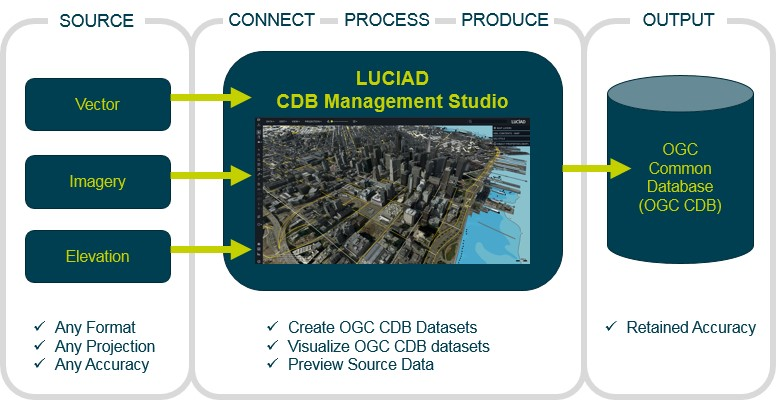

= Hexagon US Federal Technology Experiment Report

== Introduction

Hexagon US Federal’s Luciad team is pleased at the opportunity to participate in the OGC Interoperability Experiment – CDB Vector Data in GeoPackage. Luciad has a rich history in delivering solutions for OGC CDB and OGC GeoPackage data. Leveraging Luciad’s CDB / GeoPackage Studio as a starting point, Luciad was able to participate in all of the experiments including creating CDBs with GeoPackages and visualizing CDBs with GeoPackage.

The CDB Studio is a component based modular application developed using the Luciad Platform, a powerful development platform for solving C4ISR needs in the Defense, Aviation and Maritime domains.  The Luciad CDB Studio provides the ability to create OGC CDB data stores directly from imagery, elevation, and vector geospatial data products.  The application also has strong support for GeoPackages. It can export any source, including CDB into GeoPackage imagery, elevation, or vector data. It also supports a GeoPackage styling extension and the ability to convert CDB 3D Models into OGC 3D Tiles stored in GeoPackage.

.Overview of the Luciad CDB Management Studio
[[Luciad-CDB-Management-Studio]]

Hexagon US Federal participated in the following experiments:

- *Experiment 1* – Acquisition and modification of sample datasets according to the three technical alternatives
- *Experiment 2* – Replace each Shapefile, consolidating the three geometry files with a single GeoPackage
- *Experiment 3* – Store each CDB LOD as a layer in GeoPackage
- *Experiment 4* – Store each Geocell of Vector Data as a layer in GeoPackage

== Experiment Methodology - Dataset Conversion

*Experiment 1* - While the initial direction of the Interoperability Experiment involved utilizing the provided open source scripts to facilitate the conversion, there was an interest expressed from a Data Creator role in performing this operation with other software. CDB Studio features the capability to both ingest and generate CDB data stores so this was a natural fit for this application and Hexagon US Federal’s participation. The conversion process was developed to align closely with the provided workflow but was slightly altered in specific ways in line with how the application ingests data. Although an exhaustive analysis of the differences between the custom conversion logic and the provided scripts was not performed, where possible any differences are noted in this report. For Experiment 1, the shapefile data was converted by adding the feature geometry and instance-level attributes into a GeoPackage using built-in capabilities in the LuciadLightpseed API. Class attributes were stored in a separate table using the pattern in Option 1b where the CNAM attribute for each feature is a foreign key for the class attributes table. The extended attributes were stored in a separate RTE table as in Option 1d and linked by a mapping table in accordance with the RTE spec.

*Experiment 2* – For this experiment the vector feature and attribute information for each tile was converted into a single GeoPackage dataset. The CDB directory structure was maintained with folders under each vector component for the levels of detail and U designation and individual GeoPackages for each R offset.

*Experiment 3* – In this experiment all datasets for a specific vector component were combined into a single GeoPackage. The resulting dataset differed slightly from the suggested approach in that the individual tile datasets were not combined into a feature layer in the GeoPackage and instead were kept in separate layers. This facilitated the current architecture of CDB Studio which was built to ingest the data in a tiled manner. It is entirely possible to adjust this pattern to utilize combined features and leverage spatial queries against this larger feature table which might produce an ingest performance increase, but this modification was beyond the scope of the Interoperability Experiment. Class attributes were consolidated for the component into a single table.

*Experiment 4* – For the final experiment all the component datasets were further combined to create a single GeoPackage per geocell. As in Experiment 3, the class attributes were combined into a single table per component.

== Experiment Methodology - Visualization

The visualization methodology was consistent between all experiments and relied heavily on the existing logic of the CDB Studio application with minor modifications. Standard visualization metrics were recorded and did not differ greatly between the original and the experimental datasets which was expected as the LuciadLightspeed API was designed in the MVC paradigm and keeps the source data and display components independent. Data ingestion was shown to be the more pertinent metric affecting the overall performance of the visualization software. CDB data stores are ingested using a lazy loading strategy to alleviate memory concerns. The current implementation did not utilize the extended attributes so although these were added to the converted GeoPackages they had no impact on the data ingest for visualization. CDB Studio was also designed to match the CDB data stores’ tiled architecture and data loads are done as tiles are needed to populate the current display area and scale. Further modifications could be done to improve efficiency with the vector data stored in the combined GeoPackages as in experiments 3 and 4 and produce faster data ingestion but this was out of scope for this Interoperability Experiment.

Visualization metrics were gathered on the initial load of the CDB datasets which involves an animated pan/zoom to the dataset area and an initial display of the data in a view encompassing the entire dataset bounds and at a coarse detail level.

== Metrics

.Yemen
[width="90%",options="header"]
|===
| | Shapefile | Experiment 2 | Experiment 3 | Experiment 4
| Time to Convert (s) | N/A | 475 | 392 | 505
| Size on Disk (MB) | 52.2 | 156 | 61.8 | 60.2
| File Count | 9000 | 1011 | 24 | 4
| Data Ingest (s) | 0.82 | 0.30 | 3.07 | 3.80
| Heap Memory Usage (MB) | 146 | 176 | 192 | 271
| Frames Per Second 4+^.^| 170-210
|===

.Downtown LA
[width="90%",options="header"]
|===
| | Shapefile | Experiment 2 | Experiment 3 | Experiment 4
| Time to Convert (s) | N/A | 1626 | 21436 | 37113
| Size on Disk (MB) | 2389.1 | 1075.2 | 840.0 | 839.5
| File Count | 15198 | 2533 | 7 | 1
| Data Ingest (s) | 0.26 | 0.69 | 134.3 | 124.3
| Heap Memory Usage (MB) | 210 | 144 | 4368 | 7061
| Frames Per Second 4+^.^| 170-240
|===

== Notes on Metrics

*Time to Convert* – This is the total time to process the conversion of the dataset from the original version containing shapefile data into GeoPackage version. Deletion of the original shapefile data was done as a secondary manual step and was not included in this metric.

*Size on Disk* – The size on disk was obtained by viewing the Windows Explorer properties window on the Tiles folder of the generated data. It is not inclusive of unmodified data components such as imagery and elevation. The size reported for the original shapefile dataset was a measure of the replaced files.

*File Count* – Similar to the size on disk, this metric was gathered by viewing the Windows Explorer properties view on the Tiles folder of the generated data and does not include data components that were unaffected by the GeoPackage conversion process.

*Data Ingest* – Data ingest is the time taken to load all vector data needed the initial display of the CDB data. The visualization logic loads data on demand for the given tiles so this is a subset of the full dataset and could vary greatly depending on the areas and levels of detail being viewed. This metric also only reflects the modified vector datasets.

*Memory Usage* – Similar to the data ingest metric, the memory usage is a measure of the heap memory footprint of the ingested data repeated across the different sample datasets. The number reported was the delta of general system heap memory utilized before loading the CDB dataset and after. Note that this is not the final memory footprint of the datasets but instead can include temporary data structures used during the ingest process that could later be garbage collected. As such this metric is meant to show the typical memory overhead involved with loading and visualizing a CDB dataset and not the continuing persistent state.

*Frames Per Second (FPS)* – The frames per second values were gathered by utilizing a diagnostic overlay in the CDB Studio application during the data ingest. This value fluctuates during the tests and a visual inspection of the overlay data was used to determine the typical range of these fluctuations.

== Notes and Observations

-	The relative times for the dataset conversion differed with the size of the datasets involved. Generating the E3 and E4 datasets for Yemen were roughly on par with or faster than E2’s one-to-one conversion, but the large LA dataset showed a vast increase in time for E3 and E4 so the value of the specific method is tied to the expected use case. The E2 dataset with the one-to-one shapefile to GeoPackage conversion was still faster than the original dataset which indicates that this increase involves GeoPackage access and scalability with large datasets.

-	The size of the GeoPackage datasets were above that of the original shapefile data. This may be due to overhead and additional metadata in the GeoPackage format as it was much more prevalent on E2’s one-to-one conversion.

-	Adaptations to the architecture of CDB Studio could further improve efficiency with GeoPackage. Enhancements in the LuciadLightspeeed API could also aid performance, such as built-in RTE handling to minimize JDBC connections.

-	Backwards compatibility was built in with minimal effort in the modifications by defining a hierarchy of where to look for vector data. This order was arbitrarily chosen for this Interoperability Experiment, but a suggestion would be to define this order as part of the new CDB specification.

== Conclusions

*Standard Visualization Metrics* - Overall visualization performance was similar between all experiments for each dataset. Converting to GeoPackage has no significant impact either positive or negative on visualization once the data is loaded.

*Data Ingest* - Data ingest for visualization was highly dependent on the size and structure of the underlying GeoPackage datasets and the architecture of the data ingest code. Both load times and heap memory usage were much greater for the combined GeoPackages on large datasets. While major adjustments to the GeoPackage interactivity was beyond the scope of this IE minor modifications to reduce file I/O on the combined datasets showed potential for improvement in data loading time.

*Data Conversion* - For data conversion the best results were also obtained from Experiments 3 & 4. The caveat here is that some memory issues were encountered with the provided datasets as more layers and data were added to a single GeoPackage which introduces questions of scalability for these approaches.

== Recommendation

Further investigation into the optimal structure of combining multiple sub-datasets (rail, hydrography, etc) and multiple levels of detail into a single GeoPackage could alleviate several encountered performance drawbacks with the CDB datasets in Experiments 3 & 4. At this point without this investigation and guidance Hexagon US Federal recommends the CDB architecture presented in Experiment 2 which provides both a reduction in the dataset’s file count and minimizes the impact to existing CDB applications accessing data in the current tiled directory structure.
